# Pick & Strum
Pick&Strum is a specially designed website application for a business that sells stringed instruments, including anything from guitars to violins, and related accessories. It is intended to provide users with a secure and simple experience. This project was created utilizing the Django framework and supporting languages in Python, HTML, CSS, JavaScript, as well as other libraries like Crispy, Summernote Allauth and Stripe.

## Table of Content

- [Responsiveness](#responsiveness)

- [Site Scope](#site-scope)
    * [user stories](#user-stories)

- [Site Features](#site-features)
    * [Site Navigation](#site-navigation)
    * [Features left to implement](#features-left-to-implement)

- [Database Model](#database-model)

- [Wire Frame](#wire-frame)

- [Language, Framework, Library and Tools](#language-framework-library-and-tools)

- [Testing](#testing)

- [Bugs](#bugs)

- [Deployment](#deployment)

- [Credits](#credits)

- [Acknowledgment](#acknowledgment)

- [Disclaimer](#disclaimer)


## Responsiveness:
The site is responsive and can be easily accessed with full functionality in full screen, tablet and mobile screen


## Site Scope
* Responsive Design: Pick&Strum website should be fully responsive in all devices from screen size 280 upwards
* No loss to functionality between mobile devices and tablets or desktops
* Site user can view products and blog post.
* Site users can make purchase without need to create an account.
* Site users can view blog post and intaract by liking or disliking post.
* Site users can create a personal account and save and view thier order history
* Site Users can update thier data and review product they have purchased.
* Restrictions to key site features unless site user is registered and logged in
* Logged in users’ ability to perform full CRUD functionality to their profile and reviews posted on the site
* Logged in users ability to interact with posts in the blog section

### User stories
| As a...                | I can...                                                 | So I can...                                                                 |
| :------------          |   :------------------------                              |        :--------------------------                                          |
|As a user               | I can see all products           |  so that I can select some to purchase.                                          |
|As a user               | I can view individual products                          |so that I can see the rating, details, specifications, price, quantity
|As a user                |I can easily identify deals and clearance               |so that I can benefit from the deals and promotions
|As a user               |I can search for a product by name or category           |so that I can find a product easily and quickly
|As a user               |I can sort available products in order of prices or brand |so that I can make informed decision and manage purchase and expense parameters
|As a user               |I can add items I want into a bag                        |so that I can easily add or remove items
|As a user                |I can view the total of my purchase                       |so that I can make informed decision on how much I am spending
|As a user                  |I can view list of posted blogs                        |so that I can select and read any one I like
|As a user                  | I can click on a post                                  |  so that I can read the full post.
|As a user             |I can easily register an account                       |so that I will be able to view my profile
|As a user             |I can Easily Login and Logout                          |so that I can access my personal information
|As a user             |I can easily recover my password                       |so that I can log back into my profile
|As a user             |I can have a personalized user profile                 |so that I can view my order history update my user profile and save my payment confirmation
|As a user             |I can Subscribe to sites newsletter                    |so that I can receive informative newsletters and benefit from any deals available
|As a user               |I can save purchase history to my profile              |so that I can review the items and plan feature purchases
|As a user               |I can pay for products in my shopping bag securely     |so that I can feel safe and confident using my card on the site
|As a Site Admin        |I can view a data entry form                           |so that I can add, update and delete products and posts


[back to content](#table-of-content)

## Site Features
### Site Navigation:
Navigation bar is fully responsive and show different layout yet equal functionality in mobile and desktop site.
the company name also servers as a home button for users to get to the home page on a click.
a search bar is convinently placed in the middle for ease of use and in mobile it drops down below the navbar at a convinent line of sight .
on the right is the user account and store cart link, both icons are degined to show informations easily recognized by the user.
* The account icon hides a dropdown indicated by the down chevron arrow.
* If user is not logged in the options to register or login is shown.
* If logged in the opitons to manage store (if superuser), profile and logout is shown.

<details>
<summary>Navigation ScreenShots</summary>
<br>Site Navigation

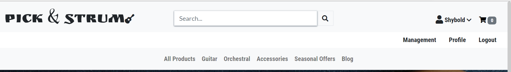

<br>Navigation user not logged in


<br>Navigation mobile view

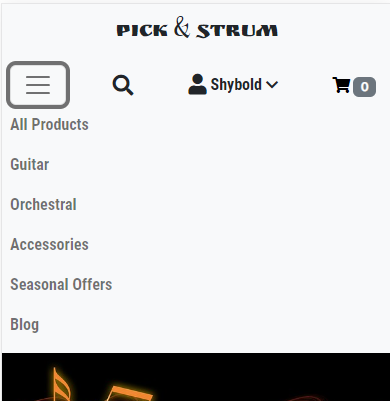

<br>Navigation mobile view search dropdown

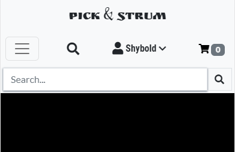
<br>
</details>
<br>

### Home Page:
The website's home page includes a strong claim that is consistent with the services it provides. An appeal to music enthusiasts and a promise to help them realize their dreams.
The home website is designed around a Carousel that periodically switches between eye-catching and informative data, offering customers the alternatives to "Shop Now," "Shop Deals," or "Blog post."
The Home page also includes quick access to certain product categories and forthcoming events.
<details>
<summary>Home Page</summary>
<br> Home Page 1

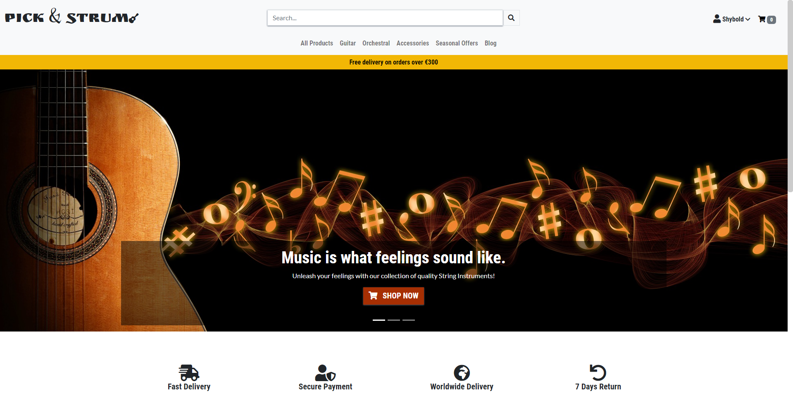
<br> Home Page 2

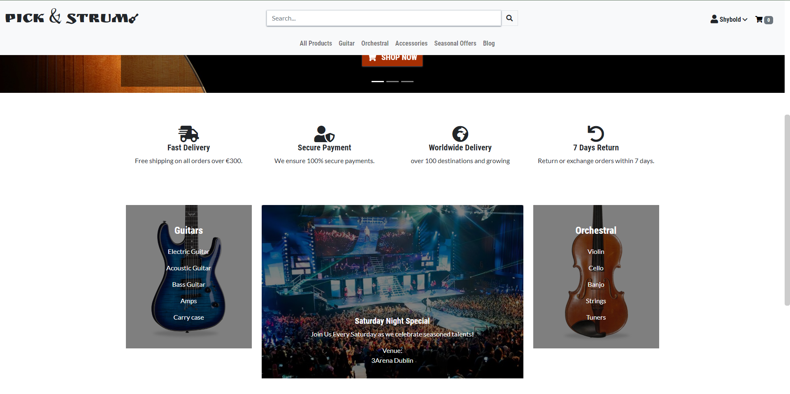
</details>

<br>

### Footer:
The footer section contains:
* A prominent newsletter signup form that lets you learn first about special deals and promotions.
* Links to PicknStrum's social media channels that are functional.
* Links to the contact, about, safety, and privacy pages of the website

<details>
<summary>Site Footer and associated pages</summary>
<br>Footer


<br> About Us

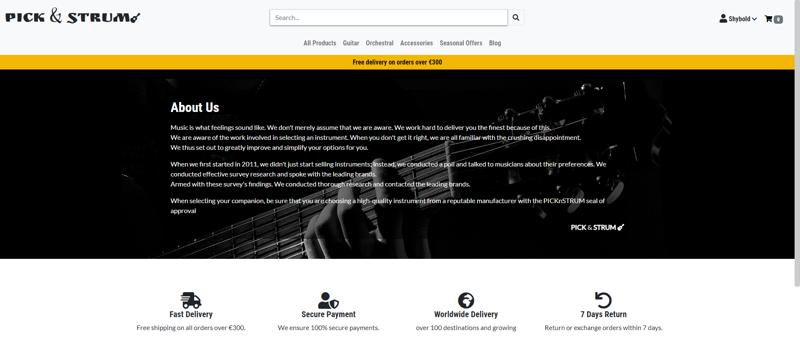
<br> Contact Us


<br>
</details>

<br>

### Product Page:
The drop-down menus on the primary navigation row below the search box can also be used to visit the Product page.
Product information, including name, price, category, and rating, is organized in responsive cards.
Editing or deleting a product is also an option for logged-in site administrators.
Users of the website can click on individual products to view them and then choose whether to add them to their shopping carts or go back to the list of all available products.
The select option dropdown allows you to change the number of products you've chosen to purchase.
The color of the cart changes when items are added, and the content counter is adjusted to reflect the quantity of items within. Users are also informed of each addition to the cart via a toast message.
<details>
<summary>Product Page</summary>
<br>Product List

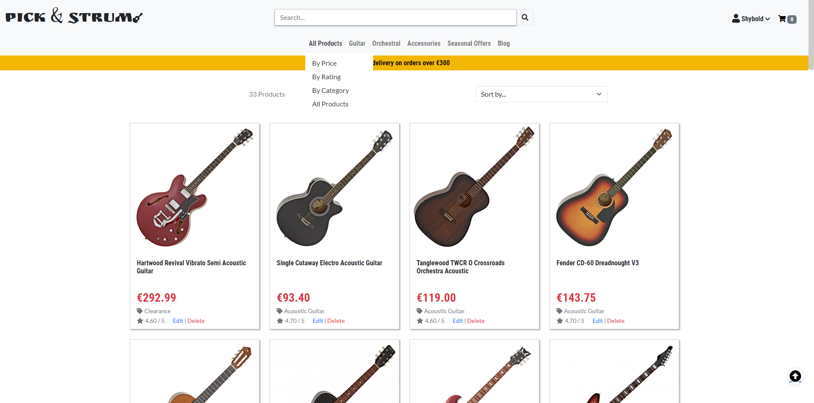
<br>Product Detail View

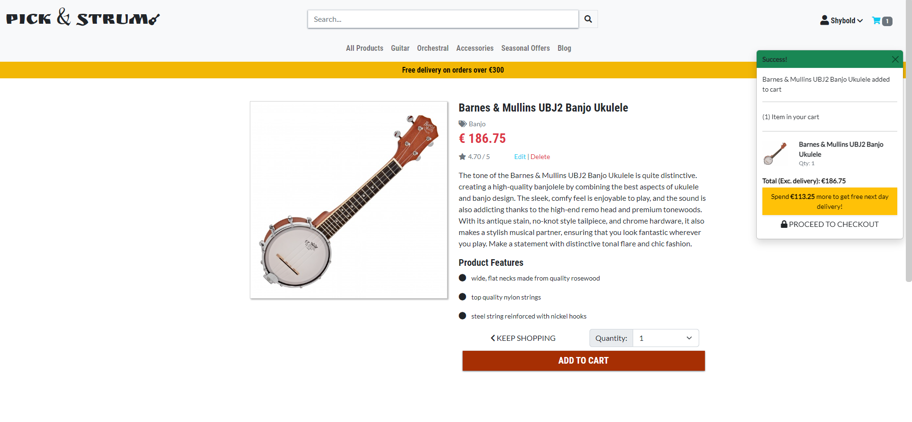
<br>
</details>
<br>

### Cart:
You can access cart content by clicking on the cart icon as well as from toast notifications. <br>
The contents can be changed or removed appropriately.
<details>
<summary>Shopping Cart</summary>
<br>Cart Content

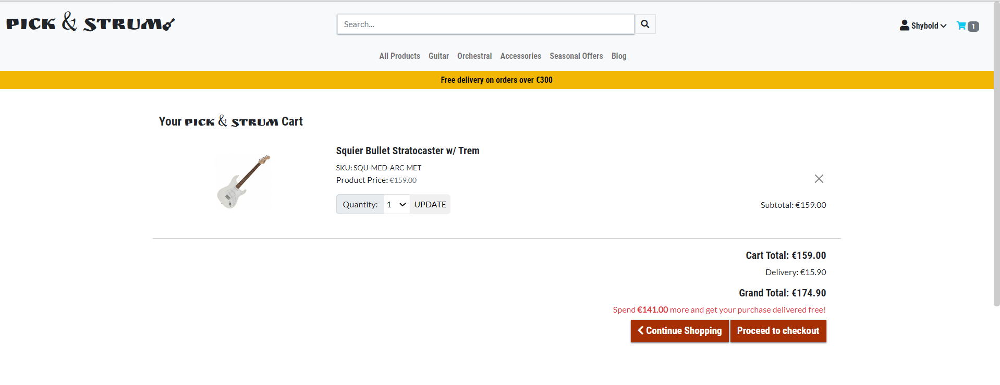
</details>
<br>

### Checkout Success:
A summary checkout success page is displayed to the user when a successful payment is made.
<details>
<summary>Checkout Success</summary>
<br>Payment Page

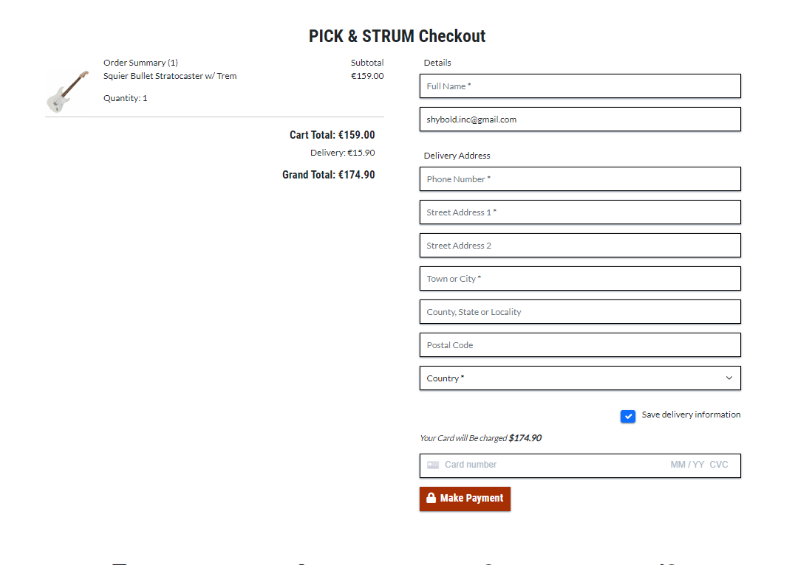
<br>Checkout Success page

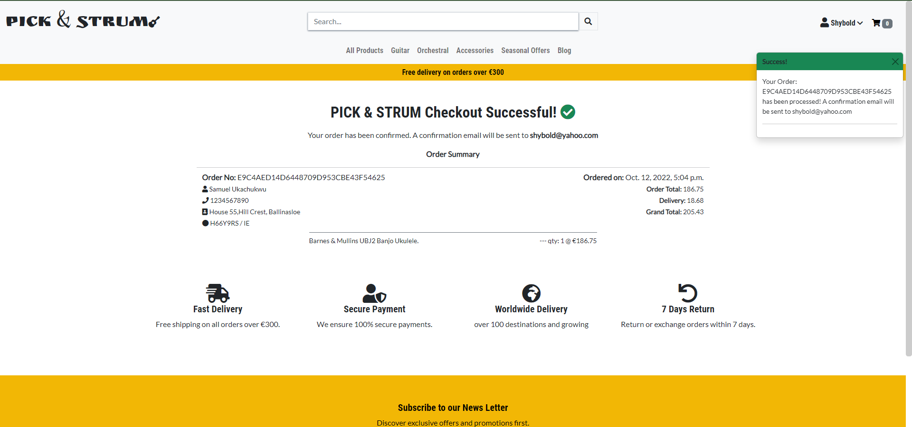
</details>
<br>

### Profile:
When logged in, registered users can examine their order history, evaluate a product they've purchased, edit or delete a review, update their profile, and change their profile image, among other straightforward CRUD operations.

<details>
<summary>Profile</summary>
<br>Profile Pages


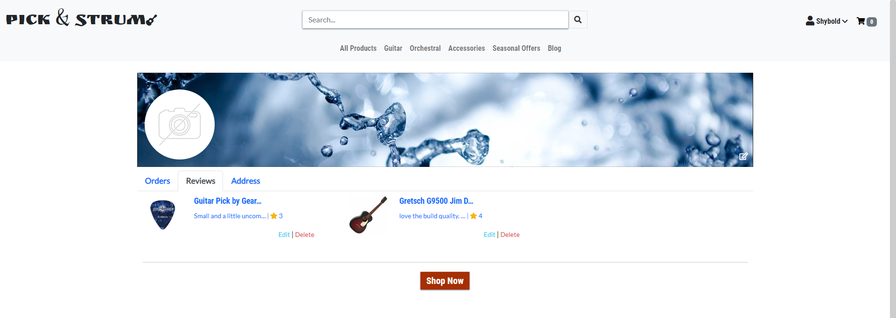
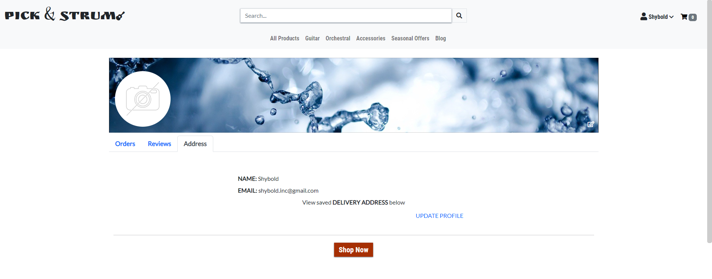
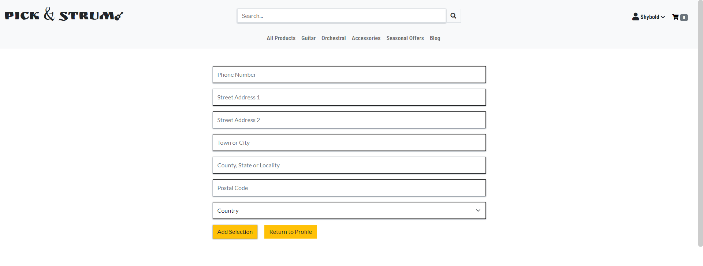
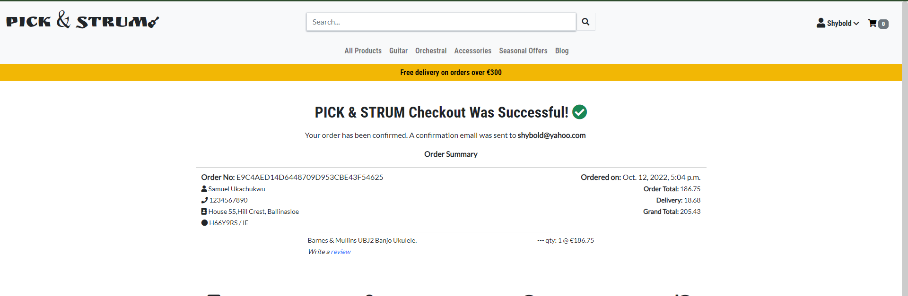
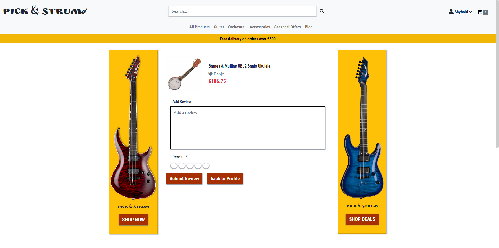
</details>
<br>


### Blog
The footer and main navigation on the home page both link to the blog. The Top stories category is displayed at the top of the page while the other categories are presented below. Posts are organized into categories. Clicking on the post image will take you to each post's page. If a user is logged in, they can interact with the detailed post view.

<details>
<summary>Blog Post</summary>
<br>Blog Page


<br>Detail Post page

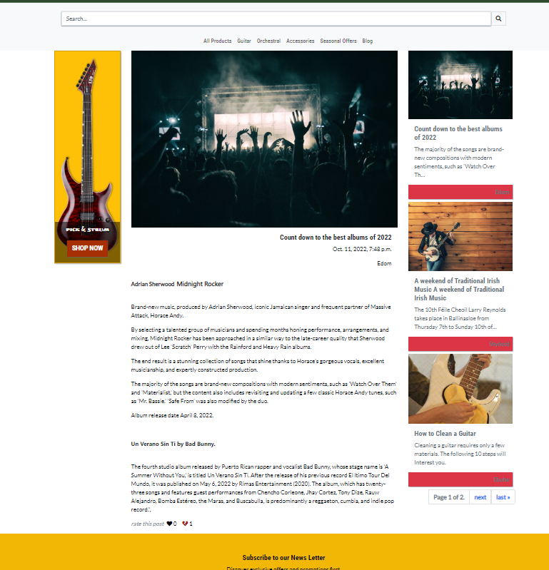
</details>
<br>

### Management:
When logged in, admin has access to the management area. Posts on a blog can be posted, altered, or removed. Posts that have been published receive a view post link, however draft posts do not. Additionally, products can be added from this page.

<details>
<summary>Management and associated pages</summary>
<br>Management Page


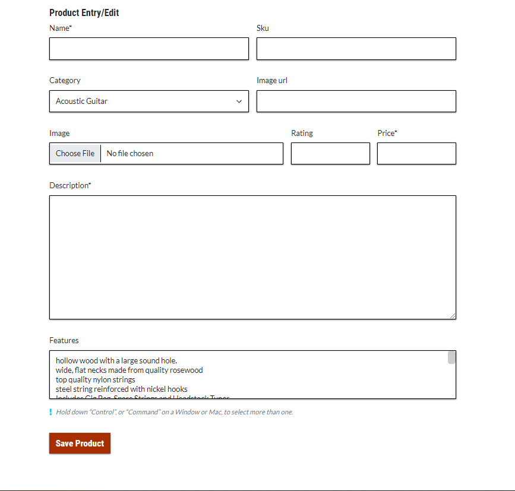
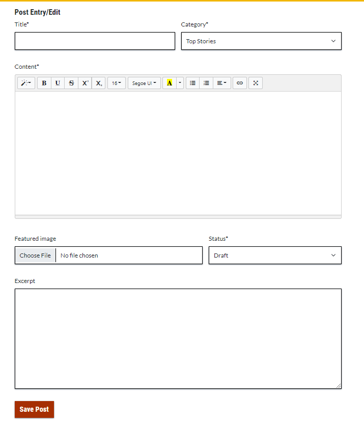
</details>
<br>

### Features left to implement:
* Product rating being calculated from user reviews.

 [back to content](#table-of-content)
 <br>

## Database Model
Relational Database Model was used in this project

<details>
<summary>Data Model</summary>
<br>Relational Data Model PicknStrum


</details>
<br>

[back to content](#table-of-content)
## Wire Frame
Mock up site was created using Balsamiq wireframing. individual frames can be seen [here](wireframe.md)

[back to content](#table-of-content)
<br>

## Language, Framework, Library and Tools
* HTML5 [More on HTML5 ](https://en.wikipedia.org/wiki/HTML5)
* CSS3 [More on CSS](https://en.wikipedia.org/wiki/CSS)
* JavaScript [More on JavaScript](https://en.wikipedia.org/wiki/JavaScript)
* Python [Python](https://www.python.org/) [Read More on Python](https://en.wikipedia.org/wiki/Python_(programming_language))
* Bootstarp 5 [Bootstrap](https://getbootstrap.com/)
* Django [Django](https://www.djangoproject.com/)
* Psycopg2 [PostgreSQl](https://www.postgresql.org/)
* Django-allauth [django-allauth read the doc](https://django-allauth.readthedocs.io/en/latest/)
* Crispy-form [django-crispy-form read the doc](https://django-crispy-forms.readthedocs.io/en/latest/install.html)
* Summernote [Summernote Docs](https://summernote.org/)
* Balsamiq [more on Balsamiq](https://balsamiq.com/)
* Heroku [more on Heroku](https://devcenter.heroku.com/)

[back to content](#table-of-content)

## Testing
Deployed site was tested Manually and codes where validated online [go to test page](test.md)

[back to content](#table-of-content)

## Bugs
* Blog page will throw error if ```blog_category.json``` fixtures are not loaded as the category "Top stories" is essential to the page

[back to content](#table-of-content)

## Deployment
The steps in deployment is recorded [here](deployment.md)

[back to content](#table-of-content)

## Credits
* Code Institute [Code Institute](https://codeinstitute.net/ie/)
* Django Doc [read the doc](https://docs.djangoproject.com/en/4.0/)
* Pixabay for the images used on the site [Pixabay](https://pixabay.com/)
* Ukachukwu Sherifat [@Nurse_Ukachukwu](https://twitter.com/nurse_ukachukwu) for external user testing.
*  [wikepedia](https://www.wikipedia.org/).
* [band camp](https://bandcamp.com/).
* [The guardian](https://www.theguardian.com/).
* [Larry Reynolds](https://www.larryreynoldsweekend.com/).
* [Gear4Music](https://www.gear4music.ie/) for all the product images, name and desccription.
* [wiki how](https://www.wikihow.com/Main-Page) materials blog.
* [ESP Guitars](https://www.espguitars.com/) images.
* [Good Reads](https://www.espguitars.com/) materials quotes.


[back to content](#table-of-content)

## Acknowledgment
* Code Institute Tutor Assistance
* Caleb Mbakwe Mentor
* Sherifat and Olivia for all the love and support

[back to content](#table-of-content)

## Disclaimer
This site was developed for educational purposes only. _Samuel Ukachukwu 13/10/2022_
