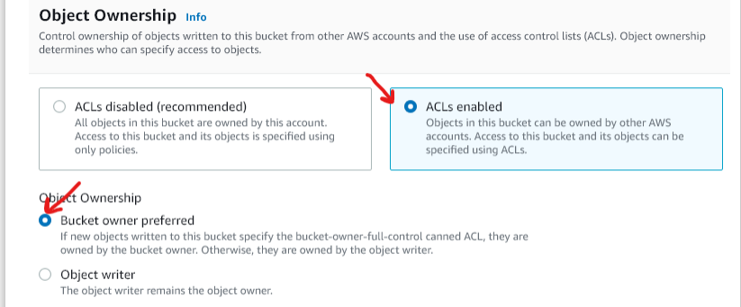
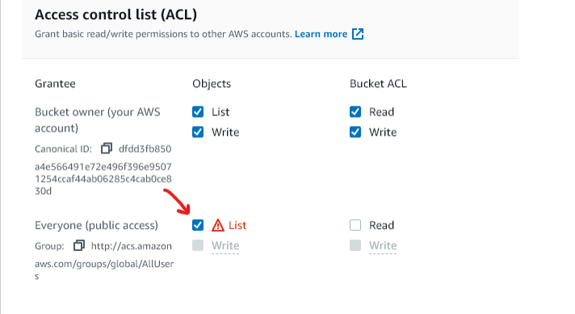
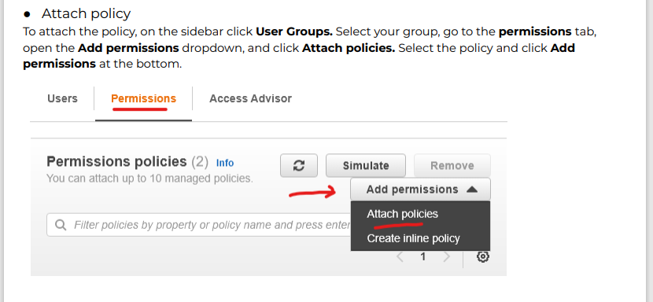

## Deployment
This project needs the following requirements dependencies to work:
```
asgiref==3.5.2
backports.zoneinfo==0.2.1
boto3==1.24.89
botocore==1.27.89
crispy-bootstrap5==0.6
dj-database-url==1.0.0
Django==3.2.14
django-allauth==0.41.0
django-countries==7.2.1
django-crispy-forms==1.14.0
django-storages==1.13.1
django-summernote==0.8.20.0
gunicorn==20.1.0
jmespath==1.0.1
oauthlib==3.2.1
Pillow==9.2.0
psycopg2-binary==2.9.4
python3-openid==3.2.0
pytz==2022.2.1
requests-oauthlib==1.3.1
s3transfer==0.6.0
sqlparse==0.4.2
stripe==4.1.0
```
Other requirements include Heroku stack-20 and a runtime.txt file in the root directory containing ```python-3.8.11```
<br><br>
The project was deployed to Heroku with the following steps:

1. create a  [Heroku](https://devcenter.heroku.com/) account and log in.
1. On the New tab click on "create new app" then name the app and choose a region for it.
1. On the resources tab search for Heroku Postgres in the Add-ons input. submit order form.
1. In the settings tab click on ```Reveal Config Vars```. This will reveal the DATABASE_URL key.
1. Copy key into your env.py file and link it to your project thus. and also copy your Django secret key into the Heroku Config Vars.
```
import os

os.environ['DATABASE_URL'] = 'xxxxxxxx'
os.environ['SECRET_KEY'] = 'xxxxxxxx'
```
and in the settings.py add the below code.
```
import os
import dj_database_url
if os.path.isfile('env.py'):
    import env
```
comment out the sqlite db and link the heroku database using this code:
```
 DATABASES = {
        'default': dj_database_url.parse(os.environ.get('DATABASE_URL'))
    }
```
6. Run Migrations:
```
 python3 manage.py migrate
 ```
7. Then load all fixtures data:
 in products and blog app
 ```
 python3 manage.py loaddata "fixture_file_name"
 ```
8. on the CLI create a requirements.txt file using the command:
 ```
 pip3 freeze -–local > requirements.txt
 ```
9.	Add a Procfile with the required codes in it: ```web: gunicorn picknstrum.wsgi:application```
10.	Change Debug to False and commit repository to Github.

11. On the Heroku app setting Config Vars add: ```DISABLE_COLLECTSTATIC = 1```
12. On the deploy tab connect your github account and search for the github repository with the name you saved it. click connect to link the repo to heroku.
10. Scroll down and setup automatic deploy to allow Heroku to update app from gitpod push and click on the manual deploy option.

### Setting Up Amazon Web services
#### S3 Bucket
1. Sign up to [amazon](https://aws.amazon.com/) web services and set up your account.
1. on the search type in S3 this will return the S3 page to you. click on it and click on ```Create bucket```.
1. name your bucket edit bucket setting thus:
* uncheck 'block all public access setting':


* on the properties section navigate to the bottom and edit the static web hosting
Enable static web hosting and set the index.html and the error.html values


4. In the Permissions section, click edit and Paste the below code into the Cross-origin resource sharing (CORS) section:
```
[
    {
        "AllowedHeaders": [
        "Authorization"
        ],
        "AllowedMethods": [
        "GET"
        ],
        "AllowedOrigins": [
        "*"
        ],
        "ExposeHeaders": []
    }
]

```
5. On the bucket policy tab select policy generator. the policy type should be S3 ```bucket policy``` and the action should be ```get object```
allow all principles by adding a * and generate policy after copying in your Amazon resource name ARN from the bucket policy tab. before you click save add /* at the end of the resource key allowing access to all resources on the bucket.
6. Go to the access control list tab and set the list object permission for everyone under the public access section.


##### Identity and Access Management
back to the menu search for ```IAM`` Identity and Access Management.
1. Create a group and name it.
2. click policies and navigate to the JSON tab select import managed policy and import the S3 full access policy. copy the bucket ARN and paste it in the resource section twice while adding /* to the last one.
3. navigate to groups and select the group you created and click attach policy. search for the policy we just created and attach.

4. Next on the User tab click add user and  create a User named "picknstrum-staticfiles-user", give them programmatic access.
5.  Add the User to the group and download the CSV file !Important



##### Connect Django to S3
Install the following two packages;
"""
pip3 install boto3
"""
"""
pip3 install django-storages
"""
then set up the S3 bucket as thus:
```
    AWS_STORAGE_BUCKET_NAME = 'picknstrum'
    AWS_S3_REGION_NAME = 'eu-west-1'
    AWS_ACCESS_KEY_ID = os.environ.get('AWS_ACCESS_KEY_ID')
    AWS_SECRET_ACCESS_KEY = os.environ.get('AWS_SECRET_ACCESS_KEY')
    AWS_S3_CUSTOM_DOMAIN = f'{AWS_STORAGE_BUCKET_NAME}.s3.amazonaws.com'

    # Static and media files
    STATICFILES_STORAGE = 'custom_storages.StaticStorage'
    STATICFILES_LOCATION = 'static'
    DEFAULT_FILE_STORAGE = 'custom_storages.MediaStorage'
    MEDIAFILES_LOCATION = 'media'

    # Override static and media URLs in production
    STATIC_URL = f'https://{AWS_S3_CUSTOM_DOMAIN}/{STATICFILES_LOCATION}/'
    MEDIA_URL = f'https://{AWS_S3_CUSTOM_DOMAIN}/{MEDIAFILES_LOCATION}/'
```
Add the AWS_ACCESS_KEY_ID and AWS_SECRET_ACCESS_KEY from the downloaded CSV file to the Heroku Config Vars and delete the ```DISABLE_COLLECTSTATIC = 1```
6. add and commit your project and push to heroku this will trigger a deployment activity.
& in the S3 bucket add a Media folder and upload all your media files to it.

### EMAIL Services
for the email services to work you need to set up a gmail account as an SMTP server.
1. create a gmail account in the accounts settings click accounts and imports then  Other Google Account Settings
1. Turn on two step verification on the security tab.
A new option will appear called app password click on it and select mail. under device type select other and type Django. the app will give you a 16 character password which you will copy and add to your heroku Config Vars and set up thus:
```
# Email setup
EMAIL_BACKEND = 'django.core.mail.backends.smtp.EmailBackend'
EMAIL_USE_TLS = True
EMAIL_PORT = 587
EMAIL_HOST = 'smtp.gmail.com'
EMAIL_HOST_USER = os.environ.get('EMAIL_HOST_USER')
EMAIL_HOST_PASSWORD = os.environ.get('EMAIL_HOST_PASS')
DEFAULT_FROM_EMAIL = os.environ.get('EMAIL_HOST_USER')
```
Note:
```
EMAIL_HOST_PASSWORD =  the password given to you
DEFAULT_FROM_EMAIL = your email address
```
<details>
<summary>Config Vars Requirements</summary>
<br>Config Vars Items


</details>

* The Deployed App can be viewed [here](https://picknstrum.herokuapp.com/)


Back to [home](README.md)