The codes were tested by doing the following:
### Manual Testing:
1.	Entered invalid inputs and wrong inputs where inputs are requested with respect to integers and strings.
2.	Recruited help from friends to use app and offer feedback
3.  Lunching site on different devices and browsers to check for responsiveness and bugs.
    * google chrome
    * fire fox
    * microsoft edge
    * Operamini

* page links are not broken ``passed``
* forms gets validated and submited as should ``passed``
* images display is responsive ```passed```
* contact us form works. ```passed```
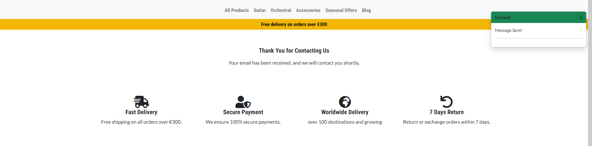
* post and product data sumbit pages work ```passed```
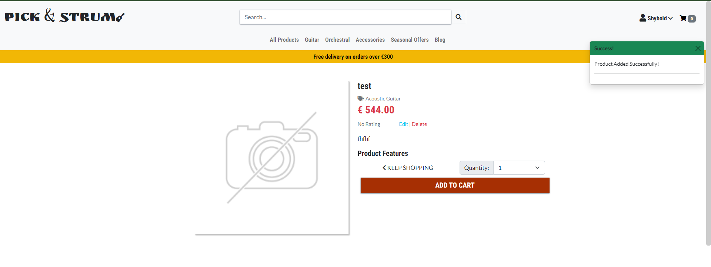


* 404 error display when page not found error is encountered ```passed```

### User Story Test
As a user I can see all products so that I can select some to purchase.

* Test that "Shop Now" and "All Product" Link works and User is directed to all product pages ``passed``

As a user I can view individual products so that I can see the rating, details, specifications, price, quantity.

* Test that clicking the product image directs users to view detail page of individual product ``passed``

As a user I can easily identify deals and clearance so that I can benefit from the deals and promotions

* Test that the "Seasonal offer" link directs users to sorted list of products under the Clearance and Deals tag. ```passed```

As a user I can search for a product by name or category so that I can find a product easily and quickly

* Test the search box option in both mobile and main navigation with random keywords and null. null returns error notification found returns a list of products and not found returns empty. ```passed```

<details>
<summary>Search tests</summary>
<br>Null Search

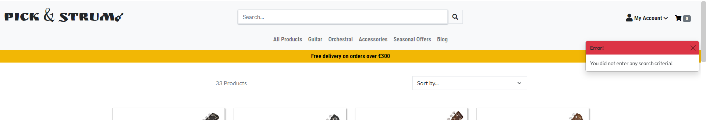

<br>Keyword found

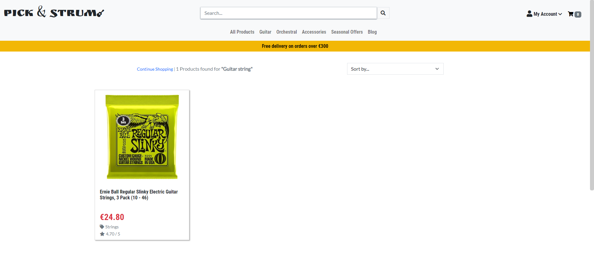

<br>Search Not Found

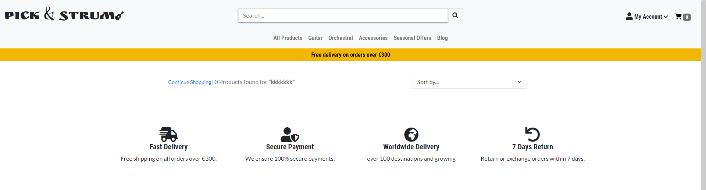
</details>

As a user I can sort available products in order of prices or brand so that I can make informed decision and manage purchase and expense parameters.

* Test that products are sorted by options in the sort box ```passed```

* 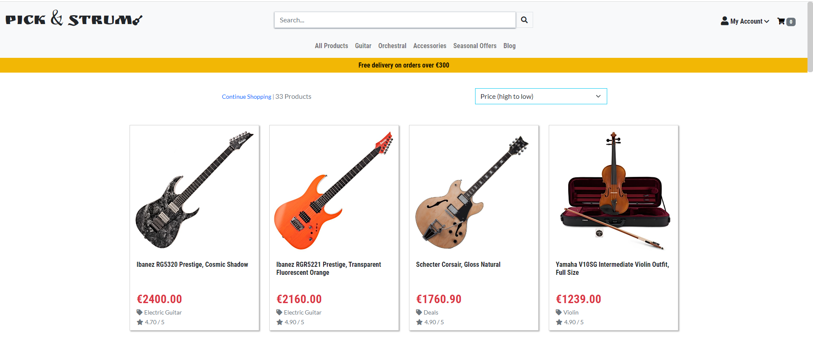

As a user I can add items I want into a bag so that I can easily add or remove items.

* Test that clicking the "ADD TO CART" button adds the selected product to Users cart and User is notified immidiately: ```passed```

* 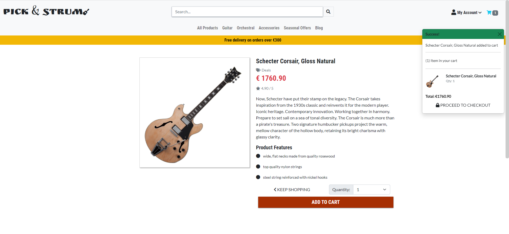

As a user I can view the total of my purchase so that I can make informed decision on how much I am spending.

* Test that user can see prices and total sum of shopping cart when added to cart or checking out ```passed```

* 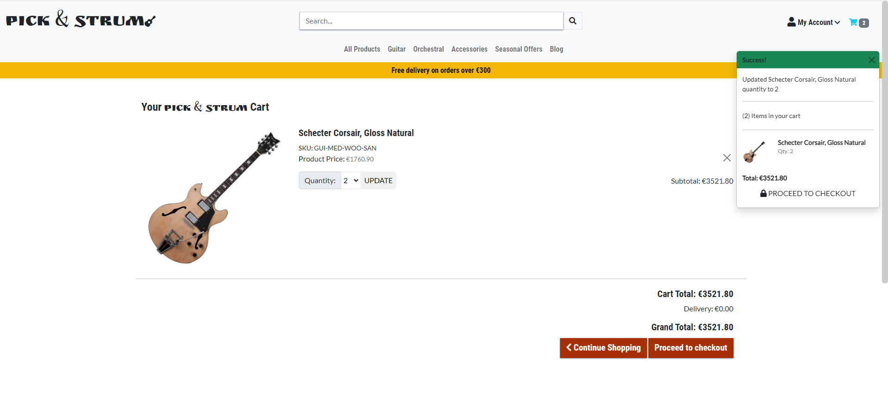

As a user I can view list of posted blogs so that I can select and read any one I like

* Test that all links labeled "Blog" directs user to the blog home page ```passed```

As a user I can click on a post so that I can read the full post..

* Test that on click of each post card user is directed to detail page of post ```passed```

<details>
<summary>Blog Pages Tests</summary>

<br>

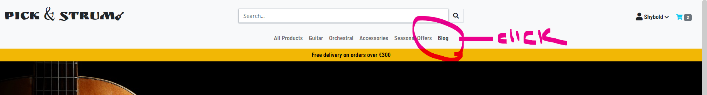

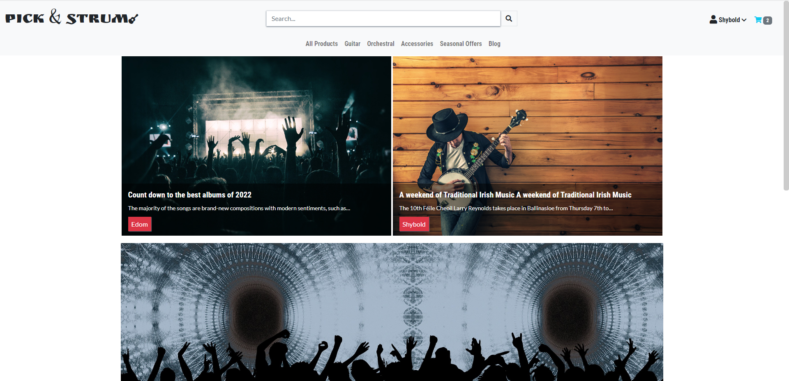

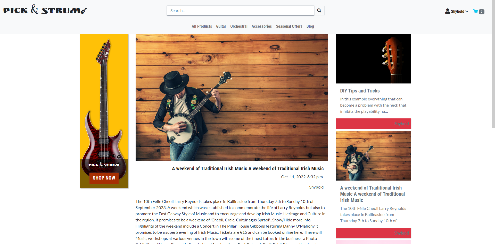
</details>

As a user I can easily register an account so that I will be able to view my profile

* Test that Users can easily creat accounts log in and log out

<details>
<summary>User Account</summary>

<br>

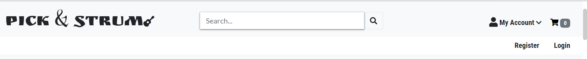

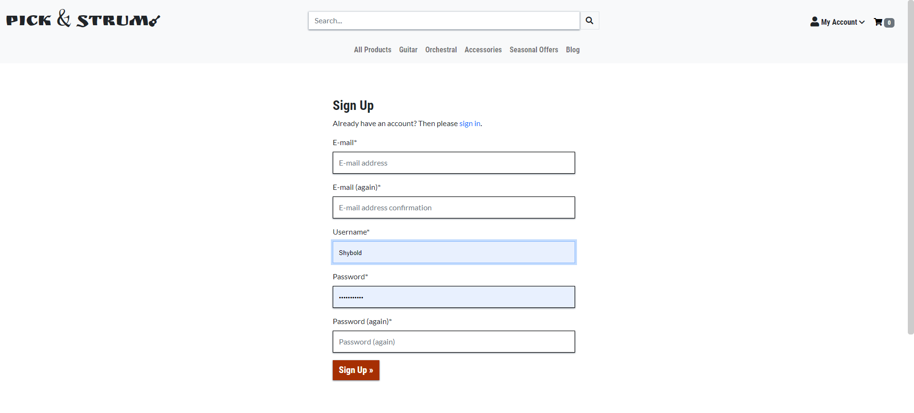

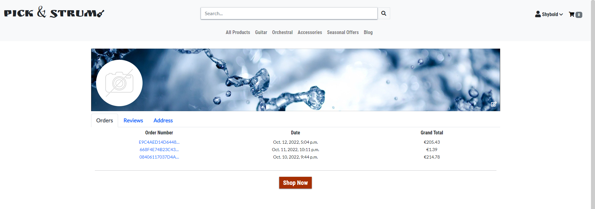
</details>

As a user I can save purchase history to my profile so that I can review the items and plan feature purchases

* Test that user can see svaed purchase history ```passed```
* Purchase history are listed in the profile pages and each order number acts as link that directs Users to to individual order history.
<details>
<summary>Order History</summary>


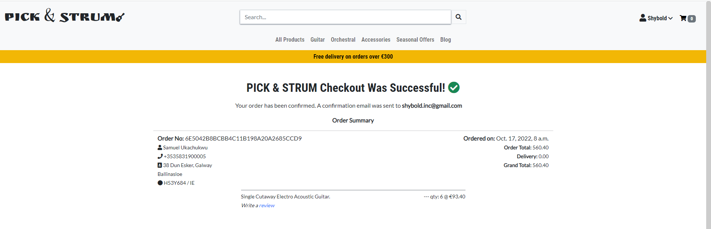

</details>

As a Site Admin I can view a data entry form so that I can add, update and delete products and posts.
* Test that only site admin logged in can view the data entry page ```passed```
* None superuser are directed to login page if they attempt to access the url "https://picknstrum.herokuapp.com/management/"
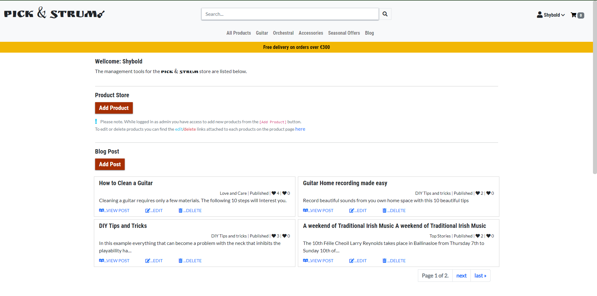
<br>
<br>


#### W3C HTML Validation: No Errors returned
No errors were returned when each html page was passed through the official W3C validator.


<details>
<summary>HTML Validation Schreenshots</summary>
<br>HTML Link Validation

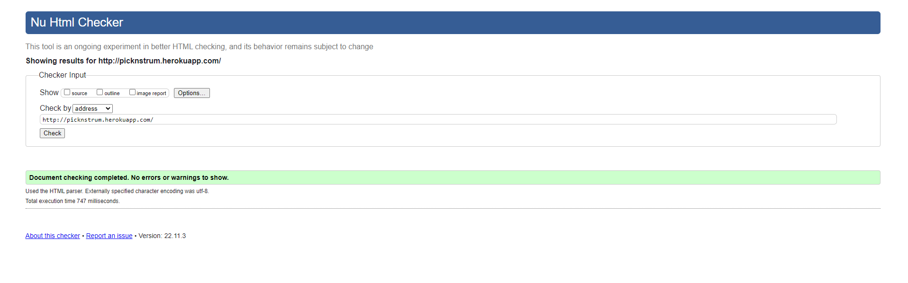

<br>Home Page Validation

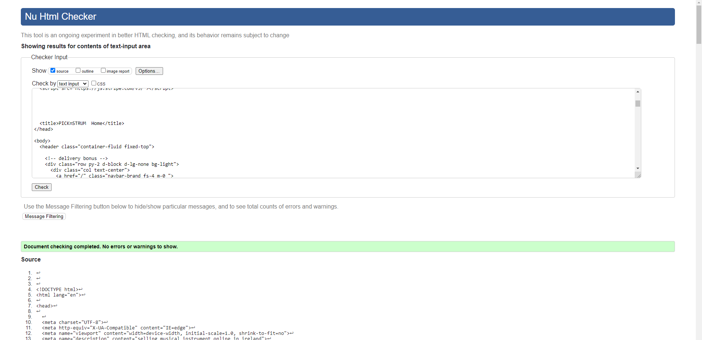

<br>Product Page Validation

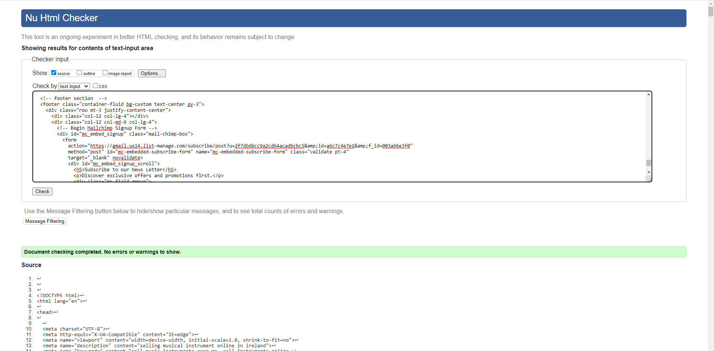

<br>Product Detail Page Validation

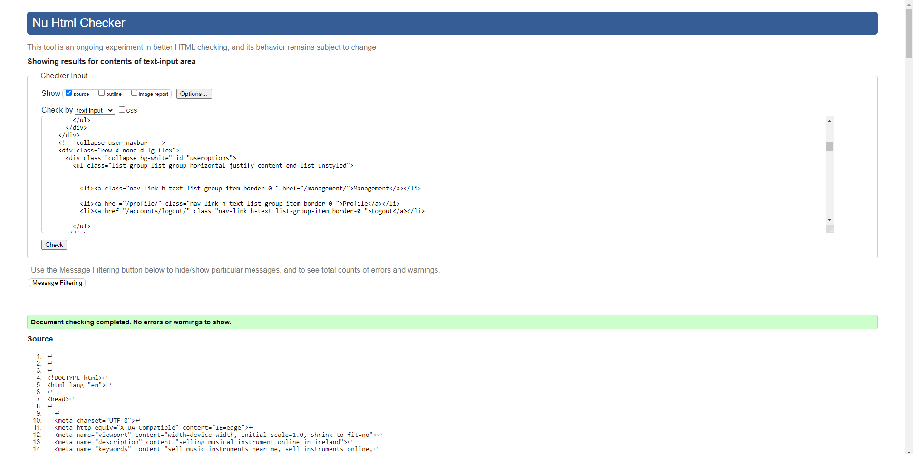

<br>Cart Page Validation

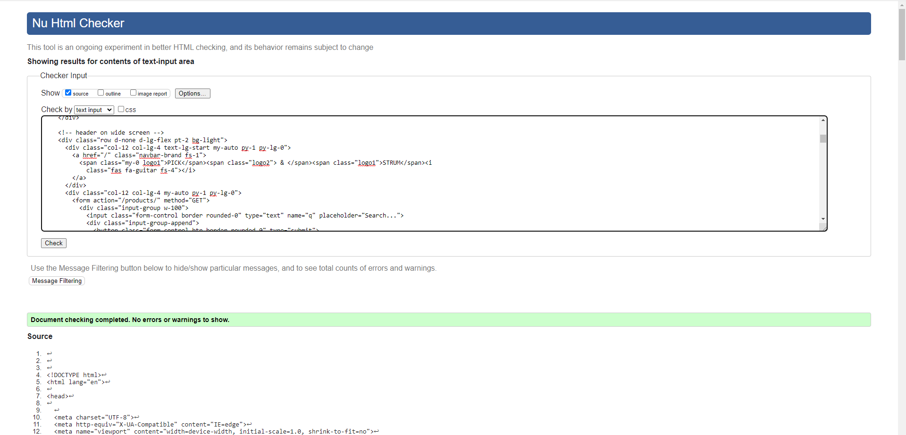

<br>Profile Page Validation

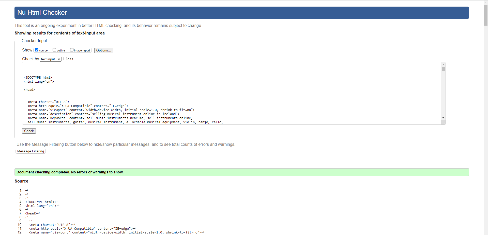
<br>
</details>
<br>


#### W3C CSS Validation: No Errors returned
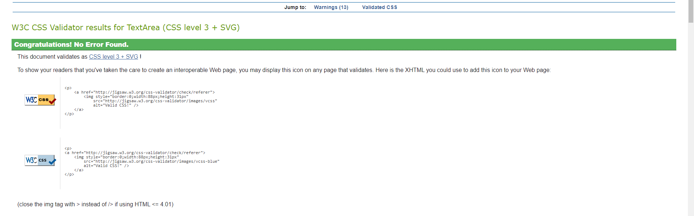

#### Pep8 Validation: No errors returned
All python code validated from the console troubleshooting using:
```
python3 -m flake8
```
note: [http://pep8online.com/] is currently parked free

#### Accessibility:

Accessibility testing was conducted using light house devtools and it confirmed that the fonts and colors selected are easy to read and accecssible.
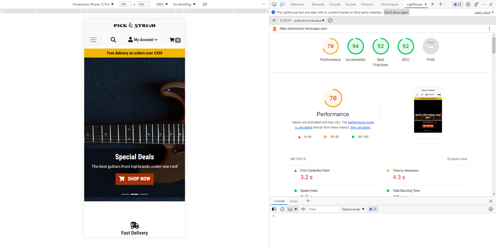


Back to [home](README.md)